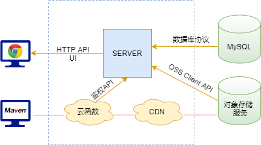

# 70-AnneY

#### 介绍
TOPIC_ID:70, TEAM_ID:1231586744, TEAM_NAME:AnneY

本项目实现了一个高可用的Maven仓库，实现服务和存储功能，支持授权上传软件包，支持私库的分享，并加速下载能力（结合CDN）等，便于在社区中推广使用。

项目运行Demo请访问：[https://maven.anneyang.me](https://maven.anneyang.me)

测试用户 [demo@gmail.com]()，密码123456。


#### 使用说明

高可用Maven仓库网站的项目背景、系统设计和使用说明请见《高可用Maven仓库项目说明书.pdf》


#### 安装教程

本项目的各个微服务使用 Docker 容器管理，通过容器内网进行通信。建议使用项目内 docker-compose.yml 完成镜像构建、容器启动：

```bash
$ git clone https://gitee.com/openeuler2020/team-1231586744.git
$ cd team-1231586744

# Edit config file
$ cp config.example.env config.env
$ vim config.env

# Build images and start services
$ mvn package
$ docker-compose up --build -d
$ docker-compose ps
```


#### 软件架构

代码结构如下：

```
team-1231586744
├── frontend/ - 前端
├── openeuler_base/ - 后端微服务网关
├── openeuler_common/ - 后端公共模块
├── openeuler_eureka/ - 后端注册中心
├── openeuler_share/ - 后端分享微服务
├── openeuler_storage/ - 后端文件微服务
├── openeuler_user/ - 后端用户微服务
├── serverless/ - 鉴权云函数
```




项目总体结构如上图所示：

1. 数据库用于存放用户信息、分享信息和私有仓库的元数据等
2. 使用对象存储服务作为构建的存储仓库，用户上传时在服务器鉴权后，直接通过预签名URL上传至对象存储Bucket 
3. 服务器Server负责鉴权和传递指令。由于不中转文件，服务器的压力大大减小，可以根据实际规模，按需增加服务器节点和负载均衡器等
4. CDN服务可加速下载能力